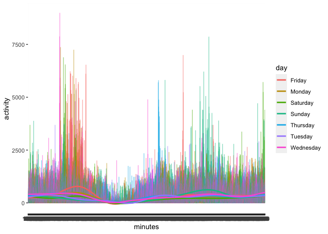
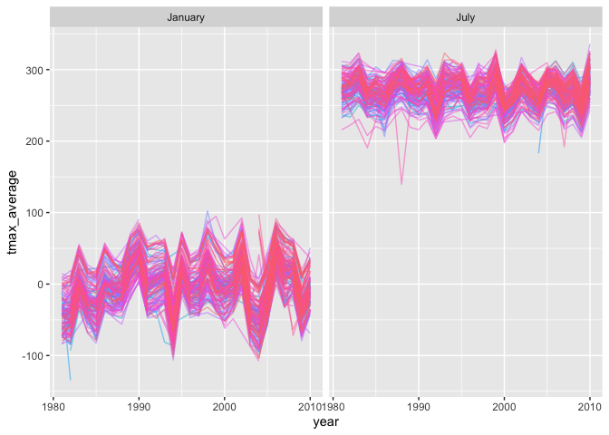
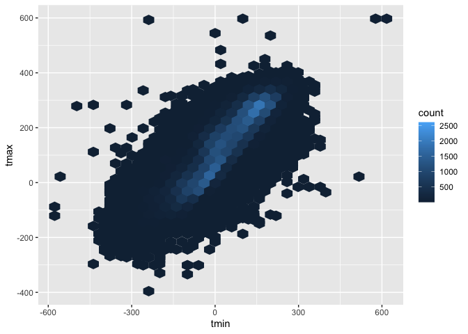
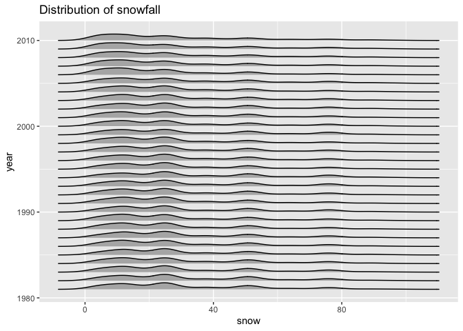
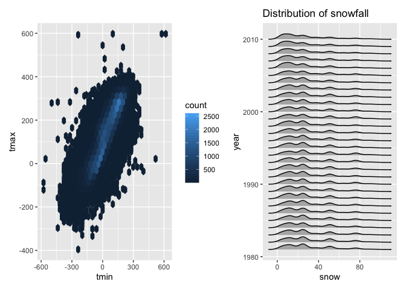

p8105_hw3_md4036
================

## Downloading the librarys

``` r
library (tidyverse)
```

    ## ── Attaching packages ─────────────────────────────────────── tidyverse 1.3.2 ──
    ## ✔ ggplot2 3.3.6      ✔ purrr   0.3.4 
    ## ✔ tibble  3.1.8      ✔ dplyr   1.0.10
    ## ✔ tidyr   1.2.0      ✔ stringr 1.4.1 
    ## ✔ readr   2.1.2      ✔ forcats 0.5.2 
    ## ── Conflicts ────────────────────────────────────────── tidyverse_conflicts() ──
    ## ✖ dplyr::filter() masks stats::filter()
    ## ✖ dplyr::lag()    masks stats::lag()

``` r
library(tidyr)
library(dplyr)
library(p8105.datasets)
```

## Problem 1 (will be given)

#### Read in the data

``` r
data("instacart")

instacart = 
  instacart %>% 
  as_tibble(instacart)
```

#### Answer questions about the data

This dataset contains 1384617 rows and 15 columns, with each row
resprenting a single product from an instacart order. Variables include
identifiers for user, order, and product; the order in which each
product was added to the cart. There are several order-level variables,
describing the day and time of the order, and number of days since prior
order. Then there are several item-specific variables, describing the
product name (e.g. Yogurt, Avocado), department (e.g. dairy and eggs,
produce), and aisle (e.g. yogurt, fresh fruits), and whether the item
has been ordered by this user in the past. In total, there are 39123
products found in 131209 orders from 131209 distinct users.

Below is a table summarizing the number of items ordered from aisle. In
total, there are 134 aisles, with fresh vegetables and fresh fruits
holding the most items ordered by far.

``` r
instacart %>% 
  count(aisle) %>% 
  arrange(desc(n))
```

    ## # A tibble: 134 × 2
    ##    aisle                              n
    ##    <chr>                          <int>
    ##  1 fresh vegetables              150609
    ##  2 fresh fruits                  150473
    ##  3 packaged vegetables fruits     78493
    ##  4 yogurt                         55240
    ##  5 packaged cheese                41699
    ##  6 water seltzer sparkling water  36617
    ##  7 milk                           32644
    ##  8 chips pretzels                 31269
    ##  9 soy lactosefree                26240
    ## 10 bread                          23635
    ## # … with 124 more rows

Next is a plot that shows the number of items ordered in each aisle.
Here, aisles are ordered by ascending number of items.

``` r
instacart %>% 
  count(aisle) %>% 
  filter(n > 10000) %>% 
  mutate(aisle = fct_reorder(aisle, n)) %>% 
  ggplot(aes(x = aisle, y = n)) + 
  geom_point() + 
  labs(title = "Number of items ordered in each aisle") +
  theme(axis.text.x = element_text(angle = 60, hjust = 1))
```

<!-- -->

Our next table shows the three most popular items in aisles
`baking ingredients`, `dog food care`, and `packaged vegetables fruits`,
and includes the number of times each item is ordered in your table.

``` r
instacart %>% 
  filter(aisle %in% c("baking ingredients", "dog food care", "packaged vegetables fruits")) %>%
  group_by(aisle) %>% 
  count(product_name) %>% 
  mutate(rank = min_rank(desc(n))) %>% 
  filter(rank < 4) %>% 
  arrange(desc(n)) %>%
  knitr::kable()
```

| aisle                      | product_name                                  |    n | rank |
|:---------------------------|:----------------------------------------------|-----:|-----:|
| packaged vegetables fruits | Organic Baby Spinach                          | 9784 |    1 |
| packaged vegetables fruits | Organic Raspberries                           | 5546 |    2 |
| packaged vegetables fruits | Organic Blueberries                           | 4966 |    3 |
| baking ingredients         | Light Brown Sugar                             |  499 |    1 |
| baking ingredients         | Pure Baking Soda                              |  387 |    2 |
| baking ingredients         | Cane Sugar                                    |  336 |    3 |
| dog food care              | Snack Sticks Chicken & Rice Recipe Dog Treats |   30 |    1 |
| dog food care              | Organix Chicken & Brown Rice Recipe           |   28 |    2 |
| dog food care              | Small Dog Biscuits                            |   26 |    3 |

Finally is a table showing the mean hour of the day at which Pink Lady
Apples and Coffee Ice Cream are ordered on each day of the week. This
table has been formatted in an untidy manner for human readers. Pink
Lady Apples are generally purchased slightly earlier in the day than
Coffee Ice Cream, with the exception of day 5.

``` r
instacart %>%
  filter(product_name %in% c("Pink Lady Apples", "Coffee Ice Cream")) %>%
  group_by(product_name, order_dow) %>%
  summarize(mean_hour = mean(order_hour_of_day)) %>%
  spread(key = order_dow, value = mean_hour) %>%
  knitr::kable(digits = 2)
```

    ## `summarise()` has grouped output by 'product_name'. You can override using the
    ## `.groups` argument.

| product_name     |     0 |     1 |     2 |     3 |     4 |     5 |     6 |
|:-----------------|------:|------:|------:|------:|------:|------:|------:|
| Coffee Ice Cream | 13.77 | 14.32 | 15.38 | 15.32 | 15.22 | 12.26 | 13.83 |
| Pink Lady Apples | 13.44 | 11.36 | 11.70 | 14.25 | 11.55 | 12.78 | 11.94 |

## Problem 2

Here is the downloaded dataset.

``` r
Accelerometer_Data = 
  read_csv(file = "./hw3data/accel_data.csv")%>%
  janitor:: clean_names() %>%
  pivot_longer(
    activity_1:activity_1440,
    names_to = "minutes",
    values_to = "activity",
    names_prefix = "activity_") %>%
  mutate (PartofWeek = recode (day, "Monday" = "Weekday", "Tuesday" = "Weekday", "Wednesday" = "Weekday", "Thursday" = "Weekday", "Friday" = "Weekday", "Saturday" = "Weekend", "Sunday" = "Weekend"))
```

    ## Rows: 35 Columns: 1443
    ## ── Column specification ────────────────────────────────────────────────────────
    ## Delimiter: ","
    ## chr    (1): day
    ## dbl (1442): week, day_id, activity.1, activity.2, activity.3, activity.4, ac...
    ## 
    ## ℹ Use `spec()` to retrieve the full column specification for this data.
    ## ℹ Specify the column types or set `show_col_types = FALSE` to quiet this message.

``` r
print(Accelerometer_Data)
```

    ## # A tibble: 50,400 × 6
    ##     week day_id day    minutes activity PartofWeek
    ##    <dbl>  <dbl> <chr>  <chr>      <dbl> <chr>     
    ##  1     1      1 Friday 1           88.4 Weekday   
    ##  2     1      1 Friday 2           82.2 Weekday   
    ##  3     1      1 Friday 3           64.4 Weekday   
    ##  4     1      1 Friday 4           70.0 Weekday   
    ##  5     1      1 Friday 5           75.0 Weekday   
    ##  6     1      1 Friday 6           66.3 Weekday   
    ##  7     1      1 Friday 7           53.8 Weekday   
    ##  8     1      1 Friday 8           47.8 Weekday   
    ##  9     1      1 Friday 9           55.5 Weekday   
    ## 10     1      1 Friday 10          43.0 Weekday   
    ## # … with 50,390 more rows

\##Data Description of Accelerometer_Data The Accelerometer_Data dataset
has 50400 rows and 6 columns. This dataset includes variables like week,
day_id, day, minutes, activity, and PartofWeek. The PartofWeek variable
was created to indicate whether it is a weekday or weekend. This dataset
describes the five weeks of data collected on a 63 year-old male with
BMI 25, who was admitted to the Advanced Cardiac Care Center of Columbia
University Medical Center and diagnosed with congestive heart failure
(CHF). In total, there are 50,400 observations and 6 variables.

## We are now going to create a `total_activity` variable

``` r
total_activity = 
  Accelerometer_Data %>%
  mutate(day = factor(day, levels = c("Monday", "Tuesday","Wednesday", "Thursday","Friday","Saturday","Sunday")))%>%
  group_by(day, week) %>%
  summarise(total_activity = sum(activity))%>%
  pivot_wider(
    names_from = day,
    values_from = total_activity)
```

    ## `summarise()` has grouped output by 'day'. You can override using the `.groups`
    ## argument.

``` r
print(total_activity)
```

    ## # A tibble: 5 × 8
    ##    week  Monday Tuesday Wednesday Thursday  Friday Saturday Sunday
    ##   <dbl>   <dbl>   <dbl>     <dbl>    <dbl>   <dbl>    <dbl>  <dbl>
    ## 1     1  78828. 307094.   340115.  355924. 480543.   376254 631105
    ## 2     2 295431  423245    440962   474048  568839    607175 422018
    ## 3     3 685910  381507    468869   371230  467420    382928 467052
    ## 4     4 409450  319568    434460   340291  154049      1440 260617
    ## 5     5 389080  367824    445366   549658  620860      1440 138421

## Now we are going to visualize the Accelerometer_Data

``` r
library(ggridges)
library(ggplot2)

Accelerometer_Data_Plot = 
  Accelerometer_Data %>%
  ggplot(aes(x = minutes, y = activity, color = day))+
  geom_line(alpha = .5) +
  geom_smooth (se = FALSE, aes(group = day))

print(Accelerometer_Data_Plot)
```

    ## `geom_smooth()` using method = 'gam' and formula 'y ~ s(x, bs = "cs")'

<!-- -->

\##Graph Description The Accelerometer_Data_Plot shows that activity
time throughout the week was quite consistent because the lines on the
graph, which represent the days of the week, don’t have any major peaks.

\##Problem 3 \##Here is the downloaded dataset.

``` r
library(p8105.datasets)
data("ny_noaa")
```

## Here is the tidyed data

``` r
NOAA_Data_tidy = 
  ny_noaa %>%
  janitor::clean_names()%>%
  separate(date, into = c("year","month","day"))%>%
  mutate (prcp = as.numeric(prcp),
          snow = as.numeric (snow),
          tmax = as.numeric(tmax),
          tmin = as.numeric(tmin))%>%
  mutate(year = as.integer (year),
         month = as.integer(month),
         day = as.integer (day)) %>%
  mutate (month = recode (month, "01" = "January", "02" = "February", "03" = "March", "04" = "April", "05" = "May", "06" = "June", "07" = "July", "08" = "August", "09" = "September", "10" = "October", "11" = "November", "12" = "December"))

view(sample_n(NOAA_Data_tidy, 1000))
```

The NOAA_Data_tidy dataset has 2595176 rows and 9 columns. This data is
retrieved from the NOAA National Climatic Data Center. This dataset
contains weather data from GHCN-Daily records from over 100,000 stations
in 180 countries and territories and the NCEI provides numerous daily
variables, including maximum and minimum temperature, total daily
precipitation, snowfall, and snow depth. However, about one half of the
stations report precipitation only; this is why there are missing data
`NA` in snow,snwd, tmax,and tmin variables. Both the record length and
period of record vary by station and cover intervals ranging from less
than a year to more than 175 years.

Next we will find the mode of snow.

``` r
library("DescTools")  

my_mode <- function(x) {                     # Create mode function 
  unique_x <- unique(x)
  tabulate_x <- tabulate(match(x, unique_x))
  unique_x[tabulate_x == max(tabulate_x)]
}
my_mode (NOAA_Data_tidy$snow)
```

    ## [1] 0

``` r
print(my_mode (NOAA_Data_tidy$snow))
```

    ## [1] 0

count (NOAA_Data_tidy, snow) \##The most common value of snow. The mode
of snowfall is 0mm.

\##Downloading the Patchwork Package

``` r
library(patchwork)
```

## A two-panel plot showing the average max temperature in January and in July in each station across years. Is there any observable/ interpretable structure? Any outliers?. Use a spagetti plot for this. Dont need to include the legend.

``` r
AverageMaxTemp_JanJul_Plot =
  NOAA_Data_tidy %>%
  group_by(month, year, id) %>%
  filter(month %in% c("January", "July")) %>% 
  summarize (
    tmax_average = mean(tmax, na.rm = TRUE))%>%
  ggplot (aes(x = year, y = tmax_average, color = id)) +
  geom_line(alpha = .5)+
  facet_grid(.~month)+
  theme(legend.position = "none")
```

    ## `summarise()` has grouped output by 'month', 'year'. You can override using the
    ## `.groups` argument.

``` r
print(AverageMaxTemp_JanJul_Plot)
```

    ## Warning: Removed 5640 row(s) containing missing values (geom_path).

<!-- -->
The average max temperature in January and in July in each station
across years does not seem to have many outliers. In July, there does
seem to have some outliers before the year 1990. The January max
temperatures seem to all cluster between -100 and 100 while the July max
temperatures seem to all cluster between 200 and 300.

## A two-panel plot showing (i) tmax vs tmin for the full dataset (use scatterplot). tmax should be on the vertical axis and tmin should be on the horizontal axis.

``` r
tmax_tmin_plot =
  NOAA_Data_tidy %>%
  drop_na(c("tmax","tmin"))%>%
  arrange(tmax, tmin, year)%>%
  ggplot(aes(x =tmin, y=tmax, group = year)) +
  geom_hex()

print(tmax_tmin_plot)
```

<!-- -->

The max temperatures and the min temperatures across the whole dataset
seem to have a linear relationship. There seems to be quite a few
outliers which are shown by the dots outside of the general distribution
of observations.

## A plot showing the distribution of snowfall values greater than 0 and less than 100 separately by year. Use geom_density_ridges for the plot

``` r
snowfall_plot =
  NOAA_Data_tidy %>%
  group_by(month, year, id) %>%
  filter( 0 < snow & snow < 100)%>%
  ggplot(aes(x = snow, y = year, group = year)) +
  geom_density_ridges (scale = .8) +
  theme (legend.position = "right") +
  labs (title = "Distribution of snowfall") 


print(snowfall_plot)
```

    ## Picking joint bandwidth of 3.76

<!-- -->
The distribution of snowfall all seem to be quite consistent. The peaks
are mostly between 0 and 40 mm of sno. After 80mm, the distributions
seem to flatten out.

## Now we will combine the two graphs.

``` r
tmax_tmin_plot + snowfall_plot
```

    ## Picking joint bandwidth of 3.76

<!-- -->
